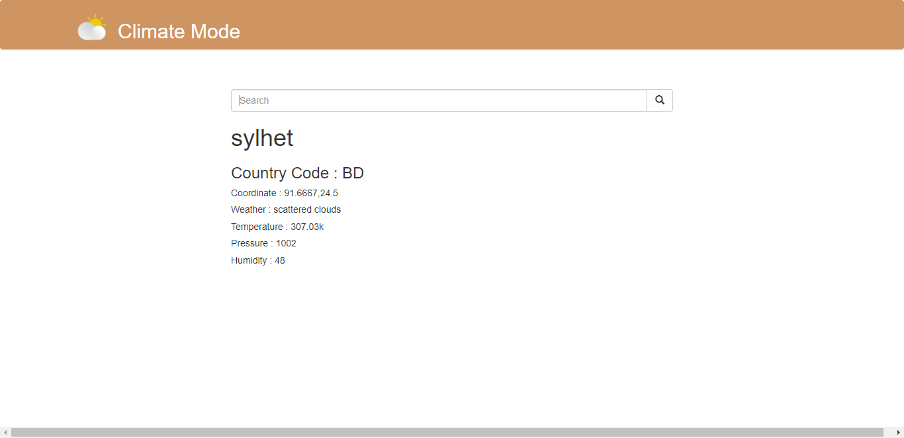

# climate-mode
Climate Mode is a Weather Detector Application using Django and Open-Weather API 🌡️

## Deployed

- [Check Out Climate Mode Application](https://climate-mode.herokuapp.com/)

## Preview SreenShot
